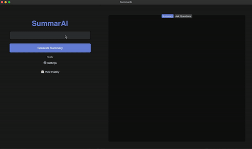

# SummarAI 🤖

  
  
  A minimal, powerful AI summarization tool for macOS

## 🎯 Overview

SummarAI is a sleek macOS application that helps you extract key information from videos and websites with just one click. Built with a focus on simplicity and efficiency, it features a clean, dark-mode interface that stays out of your way.

## 🖥️ Interface

  

## ✨ Features

- 📹 **Simple Input**: Just paste a URL or drop your content
- 🤖 **Smart Summaries**: Get AI-powered summaries instantly
- 💬 **Interactive Q&A**: Ask questions about your summaries
- 📚 **History Tracking**: Access all your past summaries
- 🌙 **Dark Mode**: Easy on the eyes, always

## 🚀 Quick Start

1. Download the latest `.pkg` file from the [releases page](https://github.com/Nesbesss/SumarAO/releases)
2. Double-click the downloaded file
3. Follow the installation prompts
4. Launch SummarAI from your Applications folder

## 💻 System Requirements

- macOS 11.0 (Big Sur) or later
- 4GB RAM minimum
- 500MB free disk space

## 🛠️ Built With

- SwiftUI for native macOS experience
- Core ML for on-device processing
- Natural Language Processing

## 🤝 Contributing

Contributions are welcome! Feel free to:

- Report bugs
- Suggest features
- Submit pull requests

Check out our [contribution guidelines](CONTRIBUTING.md) to get started.

## 📝 License

This project is licensed under the MIT License - see the [LICENSE](LICENSE) file for details.

## 🙏 Acknowledgments

- Thanks to all our contributors
- Built with love for the macOS community

## 📫 Support

- Create an issue for bug reports
- Star the repo if you find it useful
- Follow for updates

---

  Made with 💚 for a smarter way to consume content

